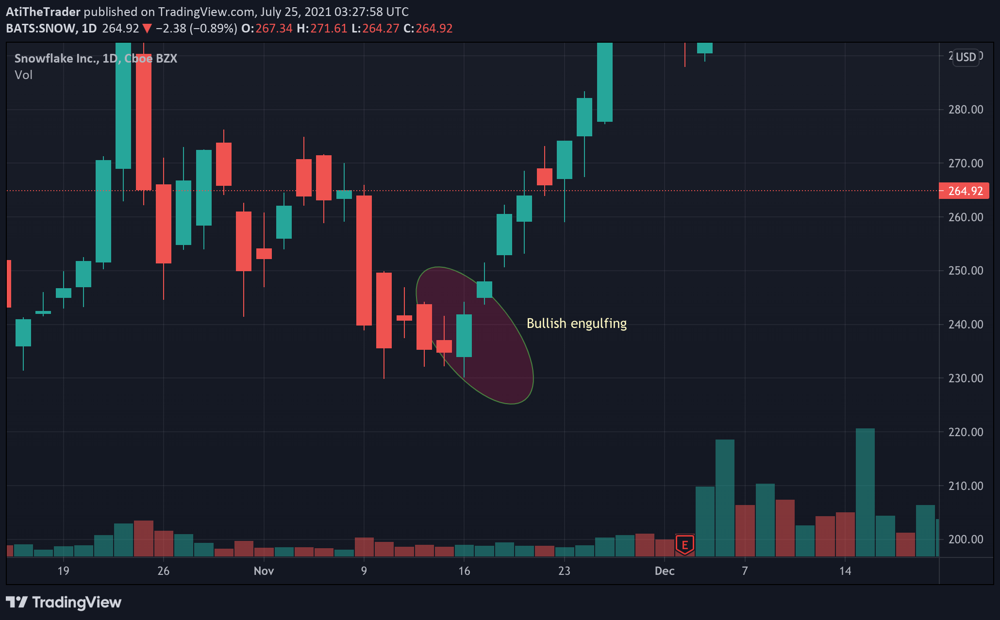

---
layout: post
title: Candle stick patterns
category: Technical
tags: [technical, candlestick]
---
From investopedia:
> A candlestick is a type of price chart used in technical analysis that displays the high, low, open, and closing prices of a security for a specific period. It originated from Japanese rice merchants and traders to track market prices and daily momentum hundreds of years before becoming popularized in the United States. The wide part of the candlestick is called the "real body" and tells investors whether the closing price was higher or lower than the opening price (black/red if the stock closed lower, white/green if the stock closed higher).

## Patterns:

### Bullish patterns:

#### Bulish engulfing
A red candle followed by a green one which fully engulfs the read candle.
The pattern is an indication of market turning point. Which means it is likely that market start going up and it is a buy signal.

 The indication is even stronger if the green candlestick engulfs 2 or three red candles 

{:chart}

