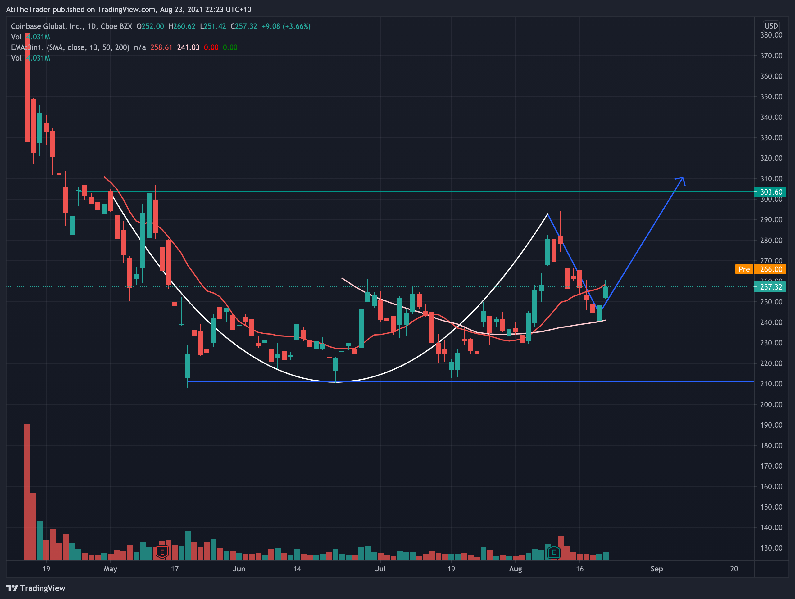

## 20/08/2021

<blockquote class="twitter-tweet">
Personally, it might be time to consider grabbing shares in <a href="https://twitter.com/search?q=%24COIN&amp;src=ctag&amp;ref_src=twsrc%5Etfw">$COIN</a>  $248.24  Let&#39;s see where the stock goes, long term, from this announcement. <a href="https://t.co/3luFxAgqFw">https://t.co/3luFxAgqFw</a> <a href="https://t.co/4cH1zHqKdE">pic.twitter.com/4cH1zHqKdE</a>
&mdash; Chris Perruna (@cperruna) <a href="https://twitter.com/cperruna/status/1428490493093163008?ref_src=twsrc%5Etfw">August 19, 2021</a></blockquote> 

## 23/08/2021 

It seems Coinbase is has formed a cup and making the handle over the course of last 15 weeks. It worth keepint an eye to see if it breaks out. Before any action should run through CANSLIM checklist 

Although now I am looking at it something is wrong. Usually cup and handle is for market correction and shakeout. However it is too soon for $COIN to have market correction and shake out. 