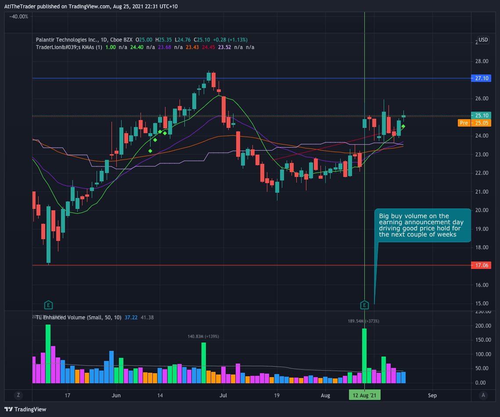

{: .logo}

### Important links
- [Investors site](https://investors.palantir.com/)
- [TradingView](https://www.tradingview.com/chart/?symbol=PLTR)

## 2021/08/01

Blog post: [Stock idea: In pursuit of Alpha with Palantir](https://www.thewealthyowl.com/post/stock-idea-in-pursuit-of-alpha-thru-palantir)

## 2021/08/16 

<blockquote class="twitter-tweet">
<a href="https://twitter.com/search?q=%24PLTR&amp;src=ctag&amp;ref_src=twsrc%5Etfw">$PLTR</a> - $24.90, the number of institutional funds owning shares went from 193 to 464, a 140% jump last quarter.  That&#39;s a big jump in sponsorship.  Holding strong in Palantir! <a href="https://t.co/3HXKL8Y8G9">pic.twitter.com/3HXKL8Y8G9</a>
&mdash; Chris Perruna (@cperruna) <a href="https://twitter.com/cperruna/status/1426971493150384133?ref_src=twsrc%5Etfw">August 15, 2021</a></blockquote> 

## 19/8/2021

<blockquote class="twitter-tweet">
Deploy <a href="https://twitter.com/hashtag/AI?src=hash&amp;ref_src=twsrc%5Etfw">#AI</a> into orbit. <a href="https://twitter.com/hashtag/Palantir?src=hash&amp;ref_src=twsrc%5Etfw">#Palantir</a>’s Meta-Constellation software can harness the power of <a href="https://twitter.com/hashtag/satellite?src=hash&amp;ref_src=twsrc%5Etfw">#satellite</a> constellations by optimizing hundreds of orbital <a href="https://twitter.com/hashtag/sensors?src=hash&amp;ref_src=twsrc%5Etfw">#sensors</a> and <a href="https://twitter.com/hashtag/EdgeAI?src=hash&amp;ref_src=twsrc%5Etfw">#EdgeAI</a> models — empowering decision-makers on Earth with insights from the exosphere. <a href="https://t.co/nLUlUJcvAv">https://t.co/nLUlUJcvAv</a>
&mdash; Palantir (@PalantirTech) <a href="https://twitter.com/PalantirTech/status/1428066859262296064?ref_src=twsrc%5Etfw">August 18, 2021</a></blockquote> 

